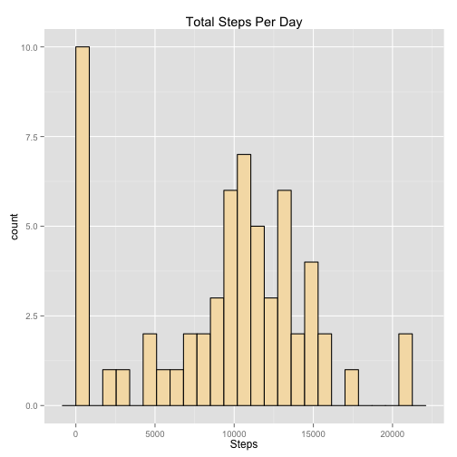
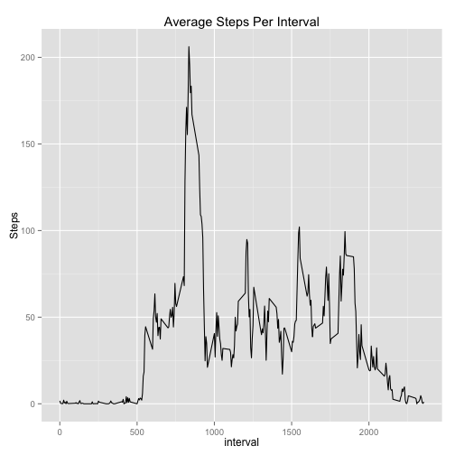
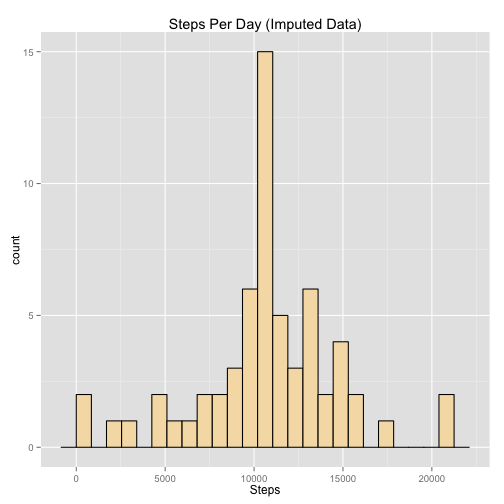
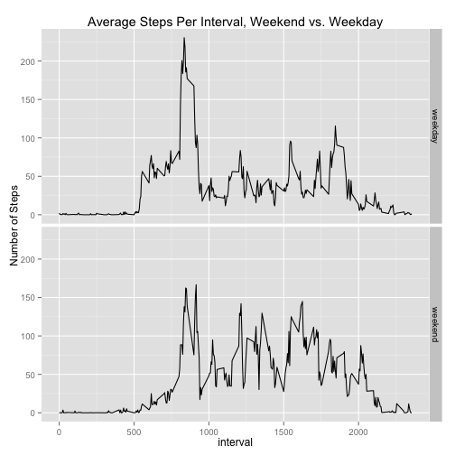

Reproducible Research: Peer Assessment 1
========================================

## Loading and preprocessing the data

Read the data from the file:

```r
actdata <- read.csv("activity.csv")
```
We will also convert the date strings to dates in R:

```r
actdata$date <- as.Date(actdata$date, "%Y-%m-%d")
```
## What is mean total number of steps taken per day?

We need to take the average of the total number of steps taken per day.

We will group and process the data using the `dplyr` package.  Load this, then group the data by day, then summarize within each day by adding up all steps taken.  We remove NA values, essentially treating these as 0 steps.

```r
library(dplyr)
stepsperday <- group_by(actdata, date) %>% 
     summarize(dailytotal = sum(steps, na.rm=TRUE)) 
head(stepsperday)
```

```
## Source: local data frame [6 x 2]
## 
##         date dailytotal
## 1 2012-10-01          0
## 2 2012-10-02        126
## 3 2012-10-03      11352
## 4 2012-10-04      12116
## 5 2012-10-05      13294
## 6 2012-10-06      15420
```

#### Histogram of Steps Per Day

We plot a histogram of the steps per day.  (Bin width was chosen via trial and error to get a reasonable distribution.)

```r
library(ggplot2)
qplot(stepsperday$dailytotal, geom="histogram", binwidth=850, fill=I("wheat"),
      col=I("black")) + labs(x="Steps", title="Total Steps Per Day")
```

 

#### Mean and Median

We compute the mean and the median steps per day, using the `stepsperday` data frame we created above:

```r
avgs <- summarize(stepsperday, Mean=mean(dailytotal), Median=median(dailytotal))
avgs
```

```
## Source: local data frame [1 x 2]
## 
##      Mean Median
## 1 9354.23  10395
```
So we see a mean steps per day of about 9,354.2 and a median of about 
10,395.

## What is the average daily activity pattern?

Next we wish to examine the daily (average) activity pattern.  We start by grouping by time interval, then average over each time interval using the mean.  We ignore any NA values, so these will not be included in the averages:

```r
bytime <- group_by(actdata, interval) %>% 
     summarize(AvgStepsPerTime = mean(steps, na.rm=TRUE))
qplot(interval, AvgStepsPerTime, data=bytime, geom="line", ylab="Steps", main="Average Steps Per Interval")
```

 

#### Interval with Maximum Average Steps

On a brief visual inspection, it appears the maximum for average steps per interval is just over 200 and occurs somewhere near the 800 mark on time intervals.  We compute the maximum and the time interval where it occurs:

```r
max(bytime$AvgStepsPerTime) # Maximum average steps
```

```
## [1] 206.1698
```

```r
as.numeric(bytime[which.max(bytime$AvgStepsPerTime), "interval"]) # Time interval of maximum
```

```
## [1] 835
```

So we have a maximum of about 206.2 steps occuring at time interval 835.

## Imputing missing values

We calculate how many rows have an NA value for "steps":

```r
sum(is.na(actdata$steps))
```

```
## [1] 2304
```

Note:  There are no NA values in "date" or "interval":

```r
sum(is.na(actdata$date))
```

```
## [1] 0
```

```r
sum(is.na(actdata$interval))
```

```
## [1] 0
```

#### Imputation Strategy

As a simple strategy for filling in the missing values, we replace a missing value in a given five-minute interval with the average steps for that five minute interval taken over all days.  We use the averages already generated above.

We first copy to a new data set, `imputeddata`. We cycle through all rows with NA values in `steps`, check the time interval, and look up the corresponding `AvgStepsPerTime` variable for that time interval in the `bytime` data set:


```r
imputeddata <- actdata
for (row in which(is.na(imputeddata$steps))) { 
     interval <- imputeddata[row, "interval"] # find which interval
     avgsteps <-                              # average steps for that interval
          bytime[bytime$interval==interval, "AvgStepsPerTime"]
     imputeddata[row, "steps"] <- avgsteps
     }
```

We now compare `imputeddata` to `activitydata`, by first finding steps per day:

```r
imputedbyday <- group_by(imputeddata, date) %>% 
     summarize(dailytotal = sum(steps)) 
```

#### Histogram with Imputed Data

We plot the histogram as we did for the original data:

```r
qplot(imputedbyday$dailytotal, geom="histogram", binwidth=850, 
      fill=I("wheat"), col=I("black")) + 
     labs(x="Steps", title="Steps Per Day (Imputed Data)")
```

 

Note that the summary of steps per day has necessarily increased, since ignoring the NA values was equivalent to treating that value as zero steps when we are summing the steps. (Also note that the large spike around zero has disappeared, because most of that bar consisted of days for which all data was missing.)

#### Mean and Median

The mean and median of the total number of steps per day will also have increased, since we have replaced what were essentially zero values with non-zero values:

```r
imputedavgs <- summarize(imputedbyday, Mean=mean(dailytotal), Median=median(dailytotal))
imputedavgs
```

```
## Source: local data frame [1 x 2]
## 
##       Mean   Median
## 1 10766.19 10766.19
```
The mean therefore increased by about 1412 steps per day, while the median increased by about 
371.2 steps per day.  

Note that while this is a significant difference, we have no way of knowing which of these results is closer to the actual average number of steps per day.  We need to know how the NA values appeared in the data set before we can try to interpret these sensibly.

## Are there differences in activity patterns between weekdays and weekends?

We will look for differences by weekdays (Monday&mdash;Friday) and weekends (Saturday and Sunday).  We start by adding a factor variable `weekpart` to separate these two groups of data.  We use the `dplyr` package again to add the new variable, using the `date` variable to identify the day of the week:

```r
imputeddata <- 
     mutate(imputeddata, weekpart = ifelse(weekdays(date) %in% c("Saturday", "Sunday"), 
                                           "weekend", "weekday"))
imputeddata$weekpart <- as.factor(imputeddata$weekpart)
```

#### Panel Plot of Weekday vs. Weekend

Now graph the average steps per time interval, averaged across weekdays as compared to weekends:

```r
impbydaytype <- group_by(imputeddata, weekpart, interval) %>%
     summarize(avgsteps = mean(steps))
qplot(interval, avgsteps, data=impbydaytype, geom="line", 
      ylab="Number of Steps", main="Average Steps Per Interval, Weekend vs. Weekday") + 
     facet_grid(weekpart ~ .)
```

 

(Note however that since the imputed data was replaced over averages which include both weekends *and* weekdays, we have weakened any potential differences between these two data sets.)
